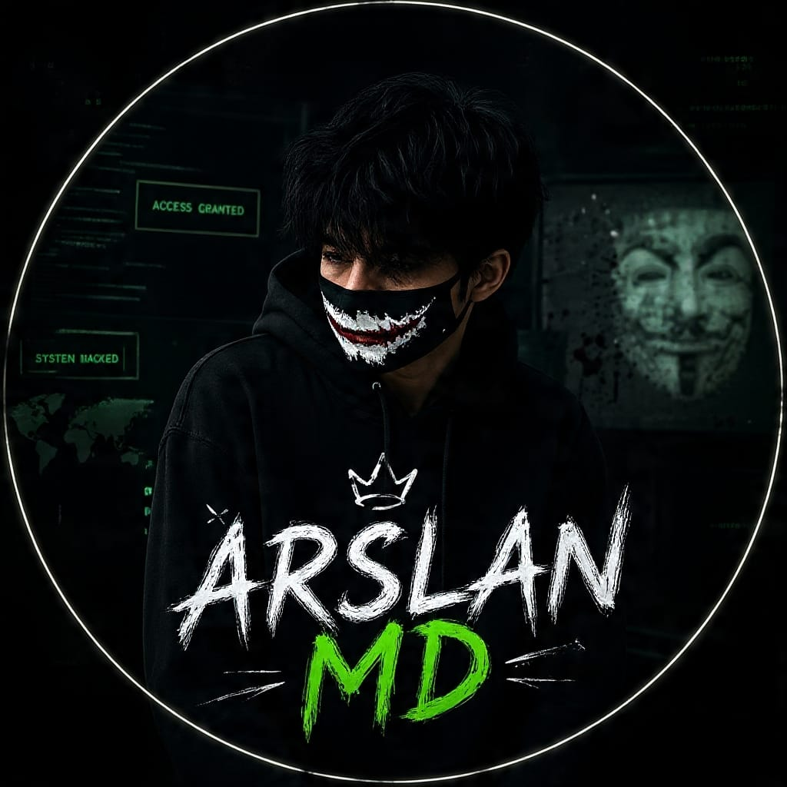
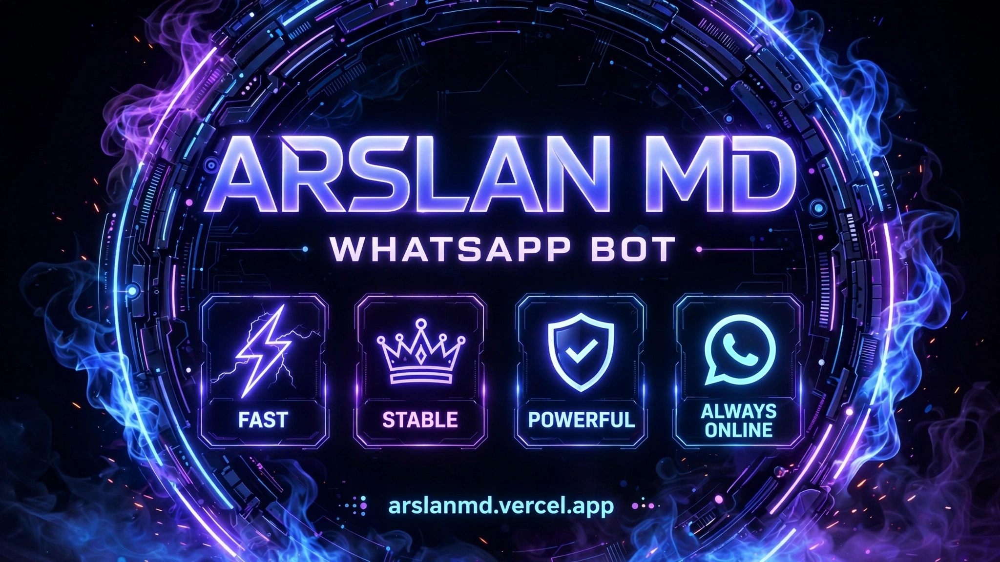
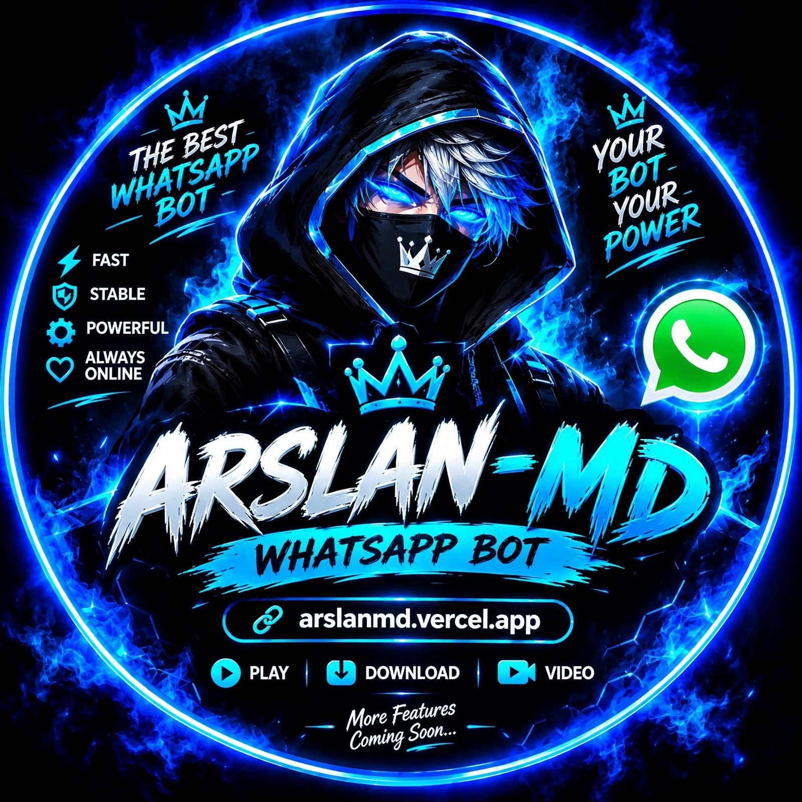
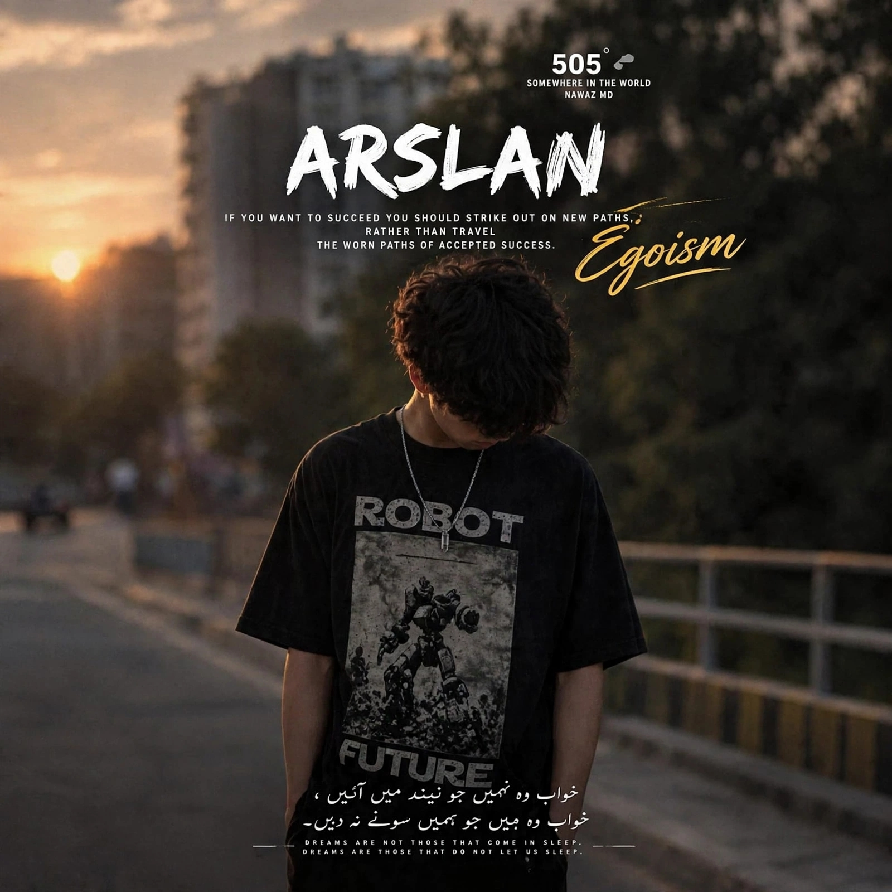

<div align="center">


<br/>



<br/><br/>


<br/><br/>


<br/>


</div>

---

## 🌌 About The Project

**ARSLAN-MD-ULTRA** is a fast, modular WhatsApp Multi-Device automation bot built with Node.js and Baileys. It combines a plugin-based command system, resilient session recovery, a browser pairing console, and deployment-ready server configuration.

<div align="center">

</div>

```yaml
Project:      ARSLAN-MD-ULTRA
Category:     WhatsApp Automation Bot
Language:     JavaScript (Node.js)
Architecture: Modular Plugin-Based System
Runtime:      Node.js 20+
Deployment:   VM | VPS | Persistent Web Service
Pairing:      Public pairing console
```

---

## 💻 Code in Action

<div align="center">

</div>

```javascript
// index.js — Baileys connection lifecycle
const { makeWASocket, useMultiFileAuthState } = require('@whiskeysockets/baileys');
const { loadPlugins } = require('./handlers');

async function startBot() {
  const { state, saveCreds } = await useMultiFileAuthState('session');
  const sock = makeWASocket({ auth: state });

  sock.ev.on('creds.update', saveCreds);
  sock.ev.on('connection.update', handleConnection);

  await loadPlugins(sock);
  console.log('✅ ARSLAN-MD-ULTRA is online');
}

startBot();
```

<div align="center">

</div>

---

## ✨ Features

<div align="center">

| 🎯 Module | 📋 Description |
|---|---|
| 📱 **Multi-Device Core** | Baileys-powered WhatsApp multi-device connection |
| 🌐 **Public Pairing Website** | Any valid WhatsApp number can request a pairing code |
| 🧩 **Plugin System** | Add commands inside the `plugins/` directory |
| 🔑 **Pairing Code Login** | Link a WhatsApp account without repeated QR scans |
| ⚙️ **Command Engine** | Centralized routing through the bot handlers |
| 📡 **Live Status** | Browser console, `/status`, and `/health` endpoints |
| ♻️ **Session Recovery** | Invalid sessions are cleared for fresh pairing |
| 🔁 **Pairing Retry Logic** | Socket readiness delay, retry/backoff, and auth diagnostics |
| 🧠 **Centralized Config** | Public or owner-only pairing controlled by environment variables |
| 🆓 **Open Source** | MIT licensed and ready to customize |

</div>

<div align="center">

</div>

---

## 🔓 Public Pairing

Public pairing is enabled by default. Each deployment supports **one active WhatsApp connection at a time**.

1. Start the bot with `npm start`.
2. Open the hosted pairing website.
3. Enter any WhatsApp number with its country code.
4. Copy the generated pairing code.
5. In WhatsApp, open **Linked devices → Link with phone number**.
6. Enter the code and keep the hosting process running.

The account that completes the public pairing becomes the current bot owner. A second account must wait until the current session disconnects or the active pairing request expires.

To restore owner-only pairing:

```env
PUBLIC_PAIRING=false
PAIRING_NUMBER=923xxxxxxxxx
```

---

## 🚀 Getting Started

### Prerequisites

- [Node.js](https://nodejs.org/) 20 or newer
- Git
- A WhatsApp account
- A persistent host for the `session/` directory

### Installation

<div align="center">

</div>

```bash
git clone https://github.com/ArslanTech-dev/ARSLAN-MD-Ultra.git
cd ARSLAN-MD-Ultra
npm ci
npm start
```

The pairing website is served by `server.js`. The host should expose the configured `PORT` and bind the application publicly.

<div align="center">

</div>

---

## ☁️ Deployment

This bot needs a long-running Node.js process, outbound WebSocket access, and persistent storage for `session/`. Use a VM, VPS, or persistent web service—not static hosting or serverless functions.

Recommended settings:

```yaml
Runtime:        Node.js 20+
Install:        npm ci
Start:          node server.js
Port:           5000 or the host-provided PORT
Storage:        Persist session/ between restarts
Pairing:        PUBLIC_PAIRING=true
```

For a VPS with PM2:

```bash
npm install -g pm2
pm2 start server.js --name arslan-md-ultra
pm2 save
pm2 startup
```

Health checks:

```text
GET /health
GET /status
```

<div align="center">

</div>

---

## 🧯 Session Recovery

If WhatsApp reports an invalid or expired session, reset the local credentials and restart:

```bash
rm -rf session
npm start
```

Never commit the `session/` directory. It contains private WhatsApp authentication credentials and is ignored by Git.

---

## 🗂️ Project Structure

```text
ARSLAN-MD-Ultra/
├── public/              # Browser pairing console
├── plugins/             # Modular commands and features
├── config.js            # Bot and pairing configuration
├── handlers.js          # Plugin loading and message dispatch
├── index.js             # Baileys startup and connection lifecycle
├── pair.js              # Pairing number validation and retry logic
├── server.js            # Pairing website and health endpoints
├── utils/               # Shared utilities and logging
├── package.json         # Runtime dependencies and scripts
└── .replit              # Replit VM and workflow configuration
```

---

## 🧩 Adding Custom Plugins

<div align="center">

</div>

1. Create a `.js` file inside `plugins/`.
2. Follow the structure used by the existing plugins.
3. Restart the bot.

```bash
touch plugins/myplugin.js
npm start
```

<div align="center">

</div>

---

## 🧬 Roadmap

- [x] Modular plugin architecture
- [x] Pairing-code authentication
- [x] Public browser pairing
- [x] Session recovery and health endpoints
- [x] Persistent VM deployment configuration
- [ ] Web-based bot control dashboard
- [ ] Usage analytics panel
- [ ] Multi-language command support
- [ ] Role-based command permissions

---

## 📸 Gallery

<div align="center">




<br/><br/>




</div>

---

## 🤝 Contributing

Contributions, issues, and feature requests are welcome.

1. Fork the repository.
2. Create a feature branch.
3. Make and test your changes.
4. Push the branch.
5. Open a pull request.

---

## ⚠️ Disclaimer

This project is **not affiliated with, endorsed by, or connected to WhatsApp Inc. or Meta**. Use responsibly and at your own risk. Automating WhatsApp may violate its Terms of Service.

---

## 📜 License

This project is licensed under the **MIT License**. You may use, modify, and distribute it with proper credit.

---

## 👤 About the Developer

<div align="center">


</div>

```yaml
Name:       Arslan
Age:        17
Country:    🇵🇰 Pakistan
City:       Bahawalpur
Education:  ICS — Punjab College, Hasilpur
Roles:      AI Assistant Programmer | AI Developer | Bots Developer
Goal:       AI/ML Engineer @ Microsoft / Google
Brand:      ARSLAN TECH'S
```

<div align="center">

📧 **Email:** arslanchkpt@gmail.com
📱 **Contact:** +92 308 4991001
🔗 **GitHub:** [@ArslanTech-dev](https://github.com/ArslanTech-dev)

[](mailto:arslanchkpt@gmail.com)
[](https://wa.me/923084991001)
[](https://github.com/ArslanTech-dev)

</div>

---

<div align="center">

## ⭐ Support The Project

If ARSLAN-MD-ULTRA helped you, consider starring the repository.


### 🔥 Powered by **ARSLAN TECH'S** 🔥


</div>
